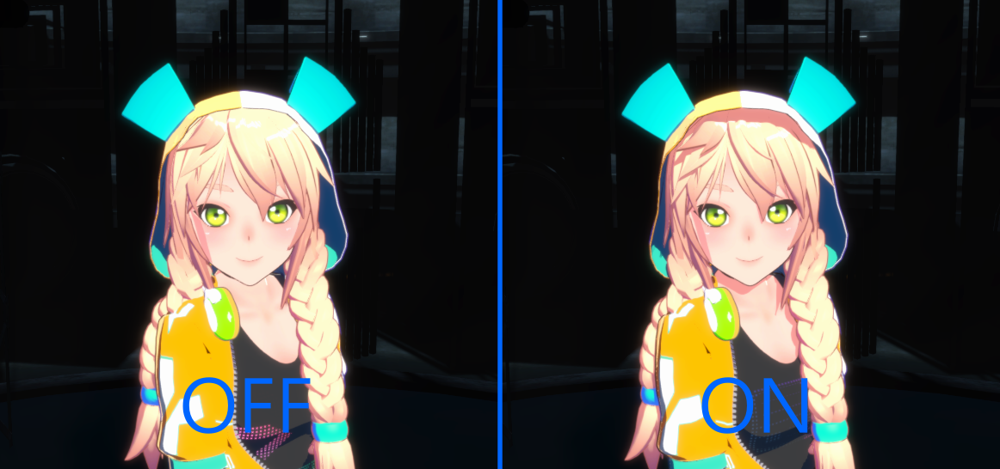
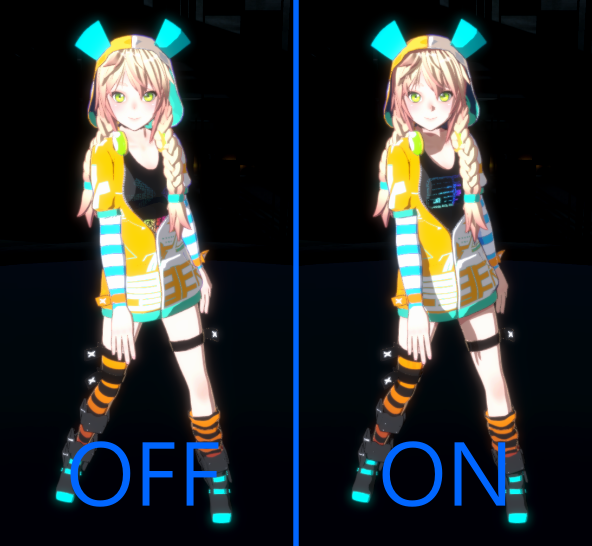
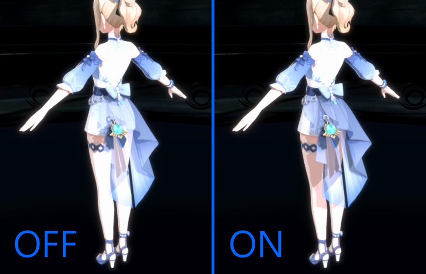
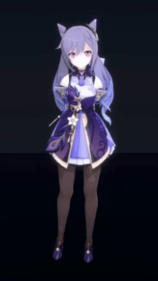
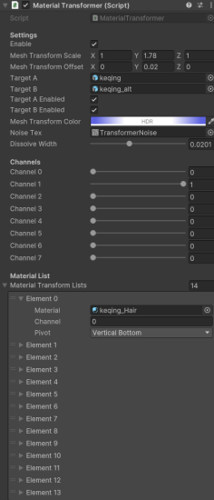

# ToonGraphics

This package contains multiple graphics features for toon shading for PC/Console Platforms, Unity URP projects.

## 1. Character ShadowMap

Character Shadowmap is designed to improve character lighting quality by adding shadow for a single character. There's a room for improvement to cover more than one character, however, currently unsupported without customizing script.

### Additional ShadowMap
It also supports additional local shadows as well, upto 3 spot lights.
Automatically calculates the most effective lights to the character among all spot lights in the scene each frame, and then draw additional shadows.

### Transparent Shadow
Transparent shadow is supported as well. However, it uses more memory so enable this when you do need this feature.

## 2. Order Independent Transparency
[Reference] https://github.com/happy-turtle/oit-unity

OIT in this package uses a linked-list method, currently support upto 8 layers for each pixel.

## 3. Material Transformer
Material Transformer helps you to implement cloth change effect or mesh transition for a single character. You can control linked materials with each channel seperately, or together.

